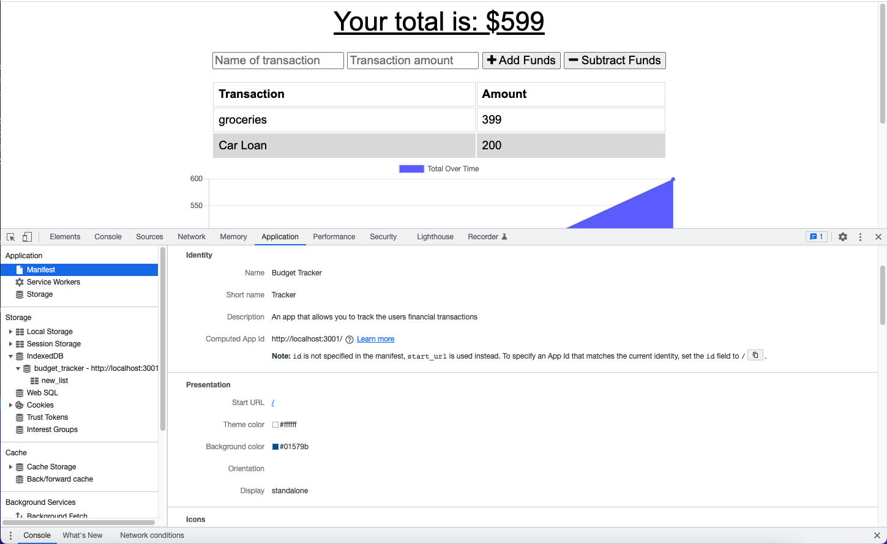

# budget-tracker

(you will see a screenshot of the manifest tab open in the Application settings)

## Description
This project was to accomplish integrating a PWA using IndexDb, a service worker for the cache, and a manifest.json file for offline frontend rendering. The PWA was created in the idb.js file. Lastly the app was also published through heroku by linking the heroku config to the mongoDb Atlas database.

## Tests
The testing was done by launching the npm start for the localhost:3001 server.

## Contributing
  The user must clone the repo, initiate the packages, and test the server through npm script "npm start" 

## Heroku Link
https://infinite-coast-24177.herokuapp.com/

 ## Questions
  If you have any questions about this repository, please contact me via kalaitzidispaul@gmail.com. You can view more of my projects at https://github.com/paulkalait

